# Steel Beam Estimator — Pipeline Flowchart

**Version 2** · full pipeline through D.2 · `READY_FOR_PHASE_E`

Open in Cursor: **Markdown Preview** (`Ctrl+Shift+V` or preview icon).

Also available: `Pipeline_Flowchart.pdf` · `Pipeline_Flowchart.html`

---

## Page 1 — Quick visual summary

```mermaid
flowchart TB
    n0["DXF Input<br/>(Framing + Reinforcement)"]
    n1["Phase A<br/>Framing Beams"]
    n2["Phase B<br/>Reinforcement Headers"]
    n3["Phase C<br/>Beam Cells"]
    n4["Phase C.5<br/>Sketch Ownership"]
    n5["Phase D.1<br/>Raw Annotations"]
    n6["D.1.1 - D.1.5<br/>Ownership & Validation"]
    n7["D.1.6<br/>Type Classification"]
    n8["D.1.6A / B<br/>Coverage & Entity Survey"]
    n9["D.1.7<br/>DIMENSION Extraction"]
    n10["D.1.7A<br/>Source Audit"]
    n11["D.1.7B<br/>Engineering Filter (132)"]
    n12["D.1.7C<br/>Integrity Audit"]
    n13["D.1.7D<br/>80 parser-ready"]
    n14["D.1.7E<br/>SFR Ownership Validator"]
    n15["Phase D.2<br/>Parsing - READY_FOR_PHASE_E"]
    n0 --> n1
    n1 --> n2
    n2 --> n3
    n3 --> n4
    n4 --> n5
    n5 --> n6
    n6 --> n7
    n7 --> n8
    n8 --> n9
    n9 --> n10
    n10 --> n11
    n11 --> n12
    n12 --> n13
    n13 --> n14
    n14 --> n15
    classDef input fill:#316d9e,color:#fff
    classDef final fill:#c0392b,color:#fff
    classDef done fill:#21262d,color:#e6edf3
    class n0 input
    class n1 done
    class n2 done
    class n3 done
    class n4 done
    class n5 done
    class n6 done
    class n7 done
    class n8 done
    class n9 done
    class n10 done
    class n11 done
    class n12 done
    class n13 done
    class n14 done
    class n15 final
```

---

## Page 2 — Flowchart with process descriptions

### DXF Input
**INPUT** · Framing plan and reinforcement drawing DXF files

↓

### Phase A - Framing Beams
**DONE** · Extract beam marks, geometry, grid references from framing layers

↓

### Phase B - Reinforcement Headers
**DONE** · Extract beam reinforcement header blocks and metadata

↓

### Phase C - Beam Cells
**DONE** · Build beam cell grid; associate headers with framing beams

↓

### Phase C.5 - Sketch Ownership
**DONE** · Assign sketch regions to beam occurrences

↓

### Phase D.1 - Raw Annotations
**DONE** · Extract TEXT/MTEXT annotations inside sketch regions

↓

### D.1.1 - D.1.5 - Ownership & Validation
**DONE** · Audit ownership, spatial/region checks, boundary leakage, reassignment

↓

### D.1.6 - Type Classification
**DONE** · Classify BAR, STIRRUP, ANCHORAGE, SFR, DIMENSION, NOTE

↓

### D.1.6A / B - Coverage & Entity Survey
**DONE** · Coverage audit; survey DIMENSION entities for engineering text

↓

### D.1.7 - DIMENSION Extraction
**DONE** · Extract DIMENSION overrides; integrate with ownership (186 total)

↓

### D.1.7A - Source Audit
**DONE** · Trace DIMENSION source: engineering override vs measurement value

↓

### D.1.7B - Engineering Filter
**DONE** · Keep engineering text; reject AutoCAD measurements (132 retained)

↓

### D.1.7C - Integrity Audit
**DONE** · Audit fragments, stirrups, anchorage, SFR, duplicates, readiness

↓

### D.1.7D - Final Dataset
**DONE** · Deduplicate, resolve fragments; 80 parser-ready annotations

↓

### D.1.7E - SFR Ownership Validator
**DONE** · Geometry-based ownership scoring for SIDE_FACE_REINF only; bars/stirrups/anchorage pass through unchanged

↓

### Phase D.2 - Parsing
**FINAL** · Parse bar qty/dia, stirrup spacing, anchorage, validated SFR — READY_FOR_PHASE_E

↓

---

*Regenerate all formats: `python scripts/generate_flowchart_pdf.py`*
