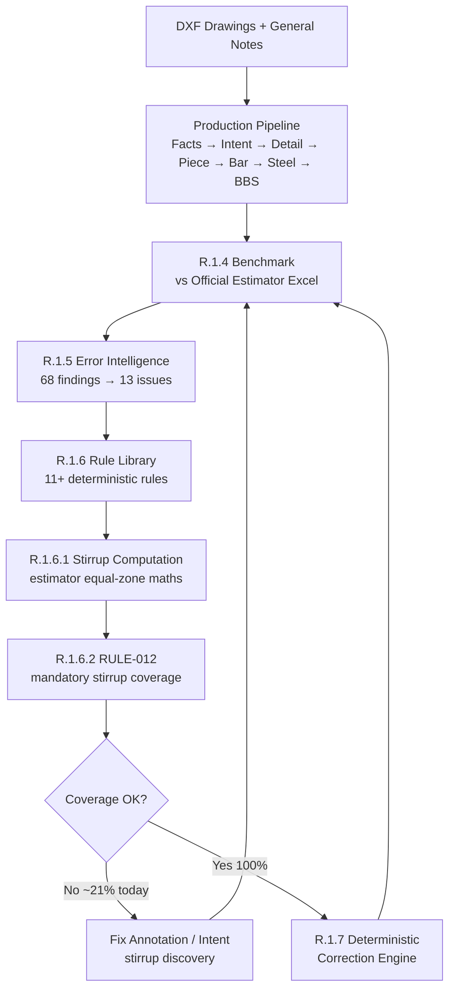
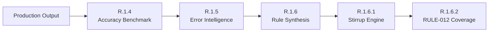
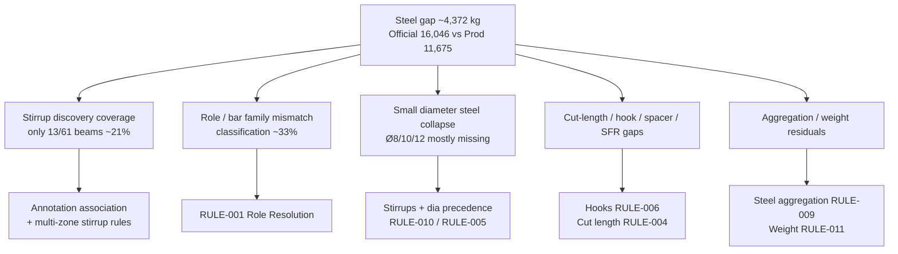
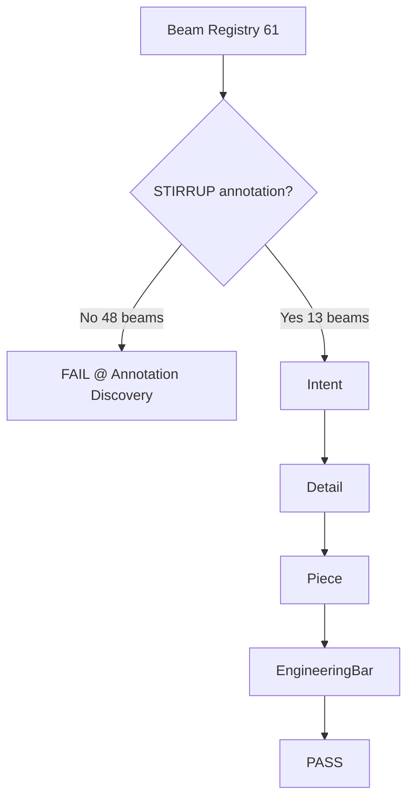
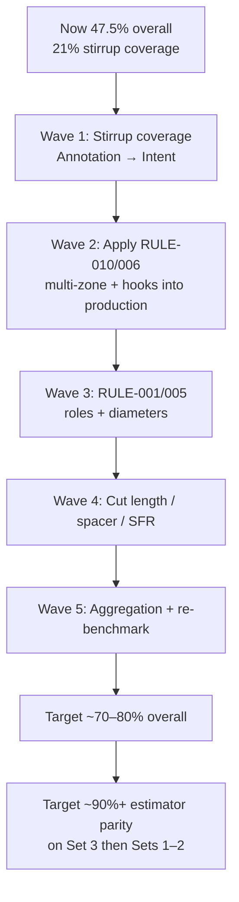

# Steel Beam Estimation — Model Progress Recap

**Document date:** 21 July 2026  
**Active branch:** Version8  
**MODEL_VERSION:** 8.8.2  
**Effort to date:** ~25–30 days  
**Benchmark reference:** Official Estimator Output Excel (Terrace Floor / Clubhouse — Set 3)

---

## 1. One-page verdict

| Question | Answer |
|----------|--------|
| Where are we vs the estimator Excel? | Production steel **~11,675 kg** vs official **16,046 kg** (**~27% under**). |
| Overall production accuracy (R.1.4 scorecard) | **47.5%** — band **CRITICAL_GAP** |
| Diameter-wise accuracy | **32.5%** composite; Ø20 strong (~88%), Ø8/10/12 very weak (stirrup-heavy) |
| Bar / role identification accuracy | **33.4%** classification match vs official reinforcement rows |
| Beam detection | **93.4% F1** — mostly solved |
| Biggest remaining hole | **Stirrups:** only **13/61 beams (~21%)** have stirrup representations (RULE-012) |
| Next gate | Resolve stirrup coverage **before** R.1.7 auto-correction |

Recent phases (R.1.4 → R.1.6.2) deliberately built **measurement, rules, and detection engines**. They explain *why* we are wrong and *how* to fix deterministically. They have **not yet** rewritten production steel totals — so the Excel gap above is still the live baseline.

---

## 2. What method did we follow to improve the model?

We did **not** chase one-off Excel hacks. We followed a **measure → diagnose → rule → validate → (then correct)** loop.

### Method principles

1. **Official Excel is ground truth** — interpreted semantically (no sheet-name / cell hardcoding).
2. **Pipeline is engineering-first** — Intent → Detail → Piece → EngineeringBar → Steel (not “guess kg”).
3. **Deterministic rules only** — no AI for bar role, diameter, or quantity decisions.
4. **Detection before correction** — RULE-012 reports missing stirrups; it does not invent them.
5. **Regression across Benchmark Sets 1–3** — set-agnostic logic; Set 3 is the live production snapshot.

### Production pipeline (current)

```mermaid
flowchart LR
    V[V.ROOT.1<br/>Beam Registry] --> GN[R.2A<br/>General Notes]
    GN --> R3[R.3 / R.3.1<br/>Geometry + Leaders]
    R3 --> R1[R.1<br/>Annotation Discovery]
    R1 --> G[R.1.2A<br/>Geometry / Spans]
    G --> I[R.1.2C<br/>Engineering Intent]
    I --> D[R.1.2D<br/>Detail]
    D --> P[R.1.3<br/>Pieces]
    P --> B[R.1.3-PI<br/>EngineeringBars + R.1.2B]
    B --> S[V.B.1<br/>Steel / BBS / Excel]
```

### Intelligence / validation loop (added in last stretch)

---

## 3. What issues did we find, and how did we solve (or bound) them?

### 3.1 Issues that are largely under control

| Issue | What was wrong | How we addressed it |
|-------|----------------|---------------------|
| Unclear pipeline / Version7 clutter | Hard to know what was production vs forensic | Froze Version7; lean **Version8** spine |
| Beam discovery | Missed / extra marks | Framing + reinforcement discovery; beam F1 now **~93%** |
| Geometry / span misuse | Wrong lengths for quantity | **R.1.2A** GeometryProvider / validated spans |
| Weak engineering object model | Bars jumped to steel without manufacturing intent | **Intent → Detail → Piece → Bar** chain (R.1.2C/D, R.1.3) |
| Duplicate EngineeringBars | Inflated / noisy bars | **R.1.2B** consolidation |
| No honest accuracy number | Could not prioritise work | **R.1.4** official workbook interpretation + KPIs |
| Errors were scattered | 68 findings, hard to act on | **R.1.5** clustered into **13 engineering issues** |
| No shared engineering rules | Fixes risked being ad-hoc | **R.1.6** rule library (now **12 rules** with RULE-012) |
| Stirrup maths vs estimator | Different zone / qty / hook conventions | **R.1.6.1** equal-zone estimator methodology + GN hooks |
| Missing stirrups silent | Pipeline continued without stirrups | **R.1.6.2 RULE-012** mandatory coverage validation |

### 3.2 Issues still open (drive most of the Excel gap)

**R.1.5 top issues (by impact):**

1. **Stirrup interpretation** — largest recurring miss (~396 kg attributed, expected ~+11% accuracy).
2. **Steel aggregation** — totals don’t fully reconcile (~393 kg / ~+5.7%).
3. **Beam discovery residuals** — a few missing / extra beams.
4. **Hook pairing** — C-hooks tied to stirrups (~212 kg / ~+8.6%).
5. **Role classification** — TOP/BOTTOM main & extra confusion (~+19% if RULE-001 fully landed).
6. **Wrong diameter** — precedence / misread (~273 kg / ~+6.4%).

---

## 4. How is the model performing vs the estimator Excel now?

### 4.1 Headline comparison (Benchmark Set 3 / Terrace Floor)

| Metric | Official Estimator Excel | Version8 Production | Gap |
|--------|--------------------------|---------------------|-----|
| Total steel | **16,046.15 kg** (16.05 MT) | **11,674.50 kg** | **−4,371.65 kg (−27.2%)** |
| Beams (official) | 63 | 61 registry / ~61 with bars | F1 **93.4%** |
| Reinforcement rows | 446 official rows | 279 EngineeringBars / 255 intents | Large miss on stirrups/hooks/spacers |
| Workbook export | Reference | Estimation_Output.xlsx produced | Workbook structure score **100%** |
| BBS shape | Official BBS | Production BBS | BBS score **80%** |

### 4.2 Overall accuracy

| KPI | Score |
|-----|-------|
| **KPI_12 Overall production accuracy** | **47.5%** |
| KPI_1 / KPI_9 Steel weight accuracy | **45.5%** |
| KPI_10 BBS accuracy | **80%** |
| KPI_11 Workbook accuracy | **100%** |
| Scorecard band | **CRITICAL_GAP** |

Interpretation: the **export machinery** is healthy; the **engineering content** (especially small-bar / stirrup families) is not yet estimator-grade.

### 4.3 Diameter-wise accuracy

Composite **diameter accuracy = 32.5%**.

| Dia (mm) | Official kg | Production kg | Abs diff kg | Pct error | Score |
|----------|-------------|---------------|-------------|-----------|-------|
| **8** | 1,499 | 272 | 1,228 | **81.9%** | ~0 (critical) |
| **10** | 3,100 | 106 | 2,994 | **96.6%** | ~0 (critical) |
| **12** | 1,700 | 253 | 1,448 | **85.1%** | ~0 (critical) |
| **16** | 2,861 | 2,455 | 406 | 14.2% | **~72%** |
| **20** | 4,373 | 4,127 | 246 | 5.6% | **~89%** |
| **25** | 2,513 | 1,689 | 824 | 32.8% | **~34%** |

**Reading:** main flexural bars (especially **Ø20**, then **Ø16**) are comparatively close. **Ø8 / Ø10 / Ø12** dominate the miss — these are exactly where **stirrups, hooks, spacers, and extras** live. That matches RULE-012 (~79% beams without stirrups).

### 4.4 Bar identification / classification accuracy

| Metric | Value |
|--------|--------|
| Official reinforcement rows | 446 |
| Classification matches | 149 |
| **Classification accuracy** | **33.4%** |
| Missing / misclassified rows (signal) | ~297 |
| Diameter mismatch signals | 118 |
| EngineeringBar beam coverage vs official beams | ~96.8% of beams have *some* bars |
| EngineeringBar score | **85%** (structure present; content incomplete) |
| Piece generation score | **55%** |
| Cut-length accuracy | **11.1%** (weak — hooks/zones/curtailment) |

**Bar identification in plain language:**

- We usually **find the beam**.
- We often **find top (and some bottom) main bars**.
- We **frequently miss or mis-label** stirrups, C-hooks, spacers, SFR, and extras — so row-level match to the estimator BBS stays ~⅓.

### 4.5 Stirrup coverage (RULE-012 — post R.1.6.2)

| Metric | Value |
|--------|--------|
| Beams checked | 61 |
| Beams with full stirrup chain | **13** |
| Coverage | **21.31%** |
| Missing | **48** (almost all lost at **Annotation Discovery**) |
| R.1.6.1 computations on *received* intents | 17 stirrup jobs / ~277 kg (engine OK; input incomplete) |

---

## 5. What we improved methodologically (even before kg closes)

| Capability | Before | Now |
|------------|--------|-----|
| Accuracy measurement | Informal / sheet hacks | Semantic Excel interpretation + 12 KPIs |
| Prioritisation | Gut feel | Ranked issues + expected kg / % gain |
| Engineering rules | Implicit in code | Explicit library RULE-001…012 |
| Stirrup maths | Ad-hoc / SI legacy mix | Estimator equal-zone + GN hooks (R.1.6.1) |
| Missing stirrup risk | Silent | Mandatory RULE-012 gate |
| Architecture | Mixed Version7 packages | Clear Version8 production + intelligence spine |

---

## 6. How can we improve from here? (prioritised)

### Wave 1 — Unblock stirrups (highest leverage)
- Raise annotation association for `2L-Y8@…` / multi-zone labels to **all beams**.
- Goal: RULE-012 coverage **21% → ≥95%**.
- Expected: large recovery on **Ø8/10** and overall steel.

### Wave 2 — Productionise stirrup computation
- Feed R.1.6.1 outputs into EngineeringBars / V.B.1 (today compute is validated but not yet the sole production path for all beams).
- Enforce equal zones, `(L/s)+1`, perimeter, GN hooks.

### Wave 3 — Role & diameter rules
- Implement **RULE-001** (TOP/BOTTOM/EXTRA/STIRRUP/HOOK/SPACER/SFR).
- Implement **RULE-005** diameter precedence.
- Expected: classification **33% → 60%+**, diameter composite up sharply.

### Wave 4 — Secondary families
- Hooks (RULE-006), spacers (RULE-008), SFR (RULE-007), cut length (RULE-004).

### Wave 5 — Close the books
- Steel aggregation (RULE-009) + weight (RULE-011).
- Re-run R.1.4; only then R.1.7 correction engine for residual deterministic fixes.

**Do not start R.1.7 auto-correction while 48 beams have zero stirrups** — corrections on incomplete cages will encode the wrong steel.

---

## 7. Time estimate (given ~25–30 days already spent)

Assumptions: same team velocity as recent Version8 phases; Set 3 first; Sets 1–2 regression after each wave; no major DXF format change.

| Wave | Focus | Calendar estimate | Cumulative from now | Plausible overall accuracy band* |
|------|--------|-------------------|---------------------|----------------------------------|
| **0 (done)** | Measure + rules + stirrup engine + RULE-012 | — | Day 25–30 | **~47.5%** (baseline) |
| **1** | Stirrup annotation coverage → ≥95% | **5–8 days** | ~Day 35–38 | **55–65%** |
| **2** | Wire estimator stirrup maths into production | **3–5 days** | ~Day 40–43 | **62–72%** |
| **3** | Role + diameter rule implementation | **5–7 days** | ~Day 47–50 | **70–78%** |
| **4** | Hooks / spacer / SFR / cut length | **5–8 days** | ~Day 55–58 | **75–85%** |
| **5** | Aggregation + multi-set hardening + R.1.7 residuals | **5–7 days** | ~Day 62–65 | **85–92%** (Set 3) |

\*Bands are **planning ranges**, not guarantees — they combine R.1.5/R.1.6 attributed gains with overlap and discovery risk.

### Practical summary for stakeholders

| Goal | Extra time beyond the 25–30 days already spent |
|------|-----------------------------------------------|
| Close the **critical stirrup hole** and re-benchmark | **~1.5–2 weeks** |
| Reach **~75%+** overall / much better dia match | **~3–4 weeks** |
| Reach **estimator-competitive (~85–90%+)** on Set 3 with Sets 1–2 stable | **~5–6 weeks** (~**total programme ~8–10 weeks** from original start) |

Risks that add time: poor leader association on crowded drawings; multi-zone stirrup labels still not discovered; official vs production beam-ID mismatches (B15/B22 etc.).

---

## 8. What “good” looks like next review

| Gate | Pass criteria |
|------|----------------|
| RULE-012 | Coverage **≥ 95%** beams with stirrup chain |
| Steel total | Abs error **≤ 10%** vs official (≤ ~1.6 MT) |
| Diameter | Ø8/10/12 no longer near-zero; composite dia accuracy **≥ 70%** |
| Classification | Bar identification **≥ 70%** |
| Overall KPI_12 | **≥ 75%** before calling R.1.7 “done” |
| Regression | Sets 1–3 deterministic; no sheet/cell hardcoding |

---

## 9. Appendix — KPI table (R.1.4 baseline)

| KPI | % |
|-----|---|
| Overall steel accuracy | 45.5 |
| Diameter accuracy | 32.5 |
| Beam detection accuracy | 93.4 |
| Beam geometry accuracy | 0.0* |
| Reinforcement classification | 33.4 |
| Piece generation | 55.0 |
| EngineeringBar | 85.0 |
| Cut length | 11.1 |
| Steel weight | 45.5 |
| BBS | 80.0 |
| Workbook | 100.0 |
| **Overall production** | **47.5** |

\*Geometry KPI at 0% in this scorecard reflects a strict span-match criterion in R.1.4; spans were improved in R.1.2A for computation, but the benchmark geometry scorer still flags residual official-vs-production span differences. Treat as a known measurement tightness, not “no geometry work done.”

---

## 10. Document control

| Item | Value |
|------|--------|
| Sources | R.1.4 / R.1.5 / R.1.6 / R.1.6.1 / R.1.6.2 phase summaries & JSON KPIs |
| Production steel snapshot | ~11,674.5 kg |
| Official steel snapshot | 16,046.15 kg |
| Recommendation at R.1.6.2 | **B** — fix stirrup coverage before correction engine |
| Companion files | This markdown + Word export in `Version8/docs/` |

---

*Prepared for internal progress review — Steel Beam Estimator Version8 (MODEL_VERSION 8.8.2).*
